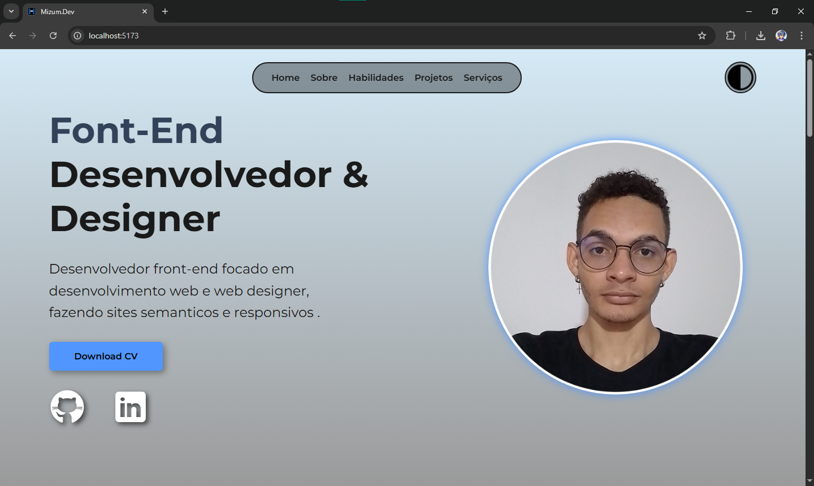

# 💻 Portfolio Pessoal

Este é o meu portfolio profissional, desenvolvido para centralizar meus projetos, habilidades e experiências na área de desenvolvimento de software. O projeto foca numa interface limpa, responsiva e com suporte a temas.

---

## 🌓 Visualização

| Dark Mode | Light Mode |
| :---: | :---: |
|  |  |

---

## 🚀 Objetivo
Apresentar a minha trajetória como desenvolvedor, facilitando o contacto com recrutadores e demonstrando na prática o uso de tecnologias modernas de interface.

---

## 🛠️ Tecnologias e Conceitos
O projeto foi construído utilizando as melhores práticas de desenvolvimento front-end:

* **React.js**: Biblioteca principal para a construção da interface.
* **CSS Modules**: Estilização escopada para evitar conflitos e manter a organização.
* **JavaScript (ES6+)**: Lógica de componentes e interatividade.
* **Mobile First**: Design planejado primeiro para dispositivos móveis, garantindo total responsividade.
* **Hooks**: Gestão de estado para alternância de temas (Dark/Light Mode).

---

## 🏗️ Estrutura da Aplicação
A arquitetura do projeto foi dividida em secções modulares para facilitar a manutenção:

* **Header**: Menu de navegação e seletor de temas.
* **Hero**: Apresentação principal e impacto inicial.
* **Sobre**: Resumo sobre a minha formação e trajetória.
* **Habilidades**: Stack tecnológica e ferramentas.
* **Projetos**: Showcase das aplicações desenvolvidas.
* **Serviços**: Áreas de atuação e especialidades.
* **Footer**: Informações de direitos e links rápidos.

---

## 🔗 Link de Acesso
Confira o projeto online: [**Visualizar Portfolio**](https://portfolio-ceh2.vercel.app/)

## 👤 Autor
Desenvolvido por **Ernand Soares**.