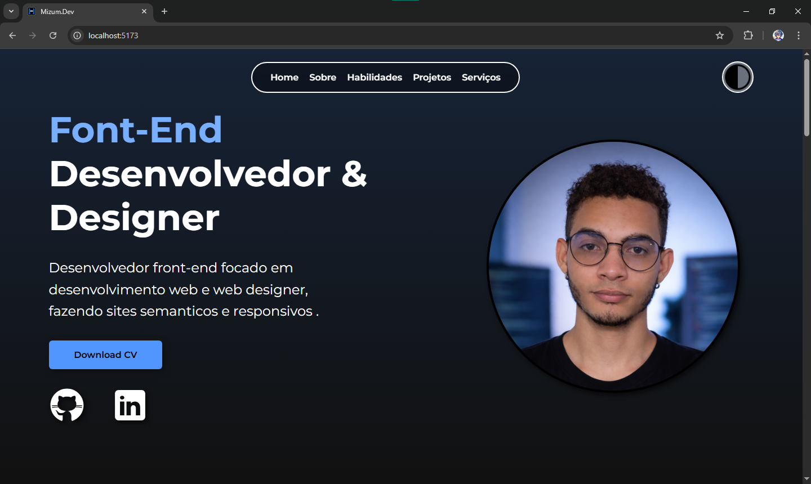

# 💻 Portfolio Pessoal

Este é o meu portfólio profissional, desenvolvido para centralizar meus projetos, habilidades e experiências na área de desenvolvimento de software. O foco principal foi criar uma interface limpa, com performance otimizada e suporte dinâmico a temas.

---

## 🌓 Visualização

| Dark Mode | Light Mode |
| :---: | :---: |
|  |  |

---

## 🚀 Objetivo
Apresentar a minha trajetória como desenvolvedor, facilitando o contacto com recrutadores e demonstrando na prática o uso de tecnologias modernas de UI/UX Designer.

---

## 🛠️ Tecnologias e Conceitos
O projeto foi construído utilizando as melhores práticas de desenvolvimento front-end:

* **React.js**: Biblioteca principal para a construção da interface.
* **CSS Modules**: Estilização escopada para evitar conflitos e manter a organização.
* **JavaScript (ES6+)**: Lógica de componentes e interatividade.
* **Mobile First**: Design planejado primeiro para dispositivos móveis, garantindo total responsividade.
* **Hooks**: Gestão de estado para alternância de temas (Dark/Light Mode).

---

## 🏗️ Estrutura da Aplicação
A arquitetura do projeto foi dividida em secções modulares para facilitar a manutenção:

* **Header**: Menu de navegação e seletor de temas.
* **Hero**: Apresentação principal e impacto inicial.
* **Sobre**: Resumo sobre a minha formação e trajetória.
* **Habilidades**: Stack tecnológica e ferramentas.
* **Projetos**: Showcase das aplicações desenvolvidas.
* **Serviços**: Áreas de atuação e especialidades.
* **Footer**: Informações de direitos e links rápidos.

---

## 🔄 Como Rodar o Projeto
Para executar este projeto localmente, siga os passos abaixo:

Clone o repositório:

``` Bash
git clone https://github.com/Herdes-s/Portfolio.git
```

Acesse a pasta do projeto:

``` Bash
cd nome-do-repositorio
```
   
Instale as dependências:

``` Bash
npm install
```

Inicie o servidor de desenvolvimento:

``` Bash
npm start
```

O projeto abrirá automaticamente no seu navegador no endereço http://localhost:3000.

---

## 🧠 Desafios e Aprendizados
Durante o desenvolvimento, enfrentei desafios que me permitiram evoluir tecnicamente:

Implementação de Temas (Dark/Light): O desafio era criar um sistema de temas que não exigisse a duplicação do código CSS.

Solução: Utilizei Variáveis CSS (:root) em conjunto com a manipulação de classes no elemento pai via JavaScript. Isso permitiu que a troca de cores fosse centralizada e eficiente, alterando apenas os valores das variáveis sem necessidade de refatorar todos os componentes.

---

## 🔗 Link de Acesso
Confira o projeto online: [**Visualizar Portfolio**](https://portfolio-ceh2.vercel.app/)

---

## 👤 Autor
Desenvolvido por **Ernand Soares**.
